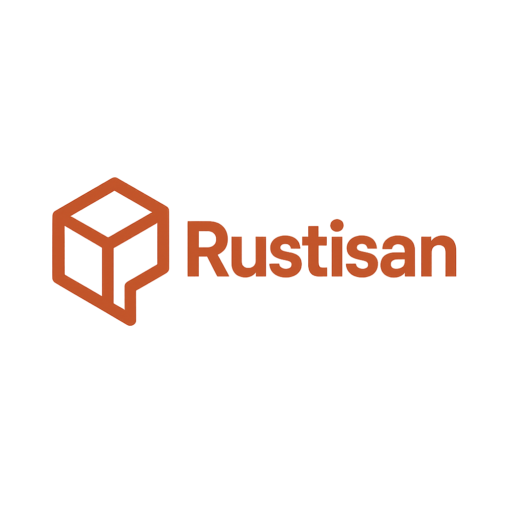

# Rustisan Framework

<div align="center">



**The Laravel-inspired web framework for Rust**

[](https://github.com/rustisan/rustisan)
[](LICENSE)
[](https://www.rust-lang.org)

[Getting Started](#getting-started) • [Documentation](#documentation) • [Examples](#examples) • [API Reference](#api-reference)

</div>

---

## What is Rustisan?

Rustisan is a modern web framework for Rust that brings the elegance and simplicity of Laravel to the Rust ecosystem. Built on top of [Axum](https://github.com/tokio-rs/axum), Rustisan provides a familiar developer experience for those coming from Laravel while leveraging Rust's performance and safety guarantees.

## ✨ Features

- **🎯 Laravel-inspired API** - Familiar syntax and patterns for Laravel developers
- **⚡ High Performance** - Built on Axum and Tokio for maximum performance
- **🛡️ Type Safety** - Leverage Rust's type system for bulletproof applications
- **🔧 Easy Configuration** - Simple TOML-based configuration
- **🌐 Modern Routing** - Intuitive routing with support for groups and middleware
- **📦 Modular Architecture** - Well-organized crates for different concerns
- **🔍 Built-in Observability** - Integrated logging and tracing
- **🧪 Testing Ready** - Built with testing in mind

## Quick Start

### Installation

Add Rustisan to your `Cargo.toml`:

```toml
[dependencies]
rustisan-core = "0.1.0"
rustisan-orm = "0.1.0"
tokio = { version = "1.0", features = ["full"] }
serde = { version = "1.0", features = ["derive"] }
serde_json = "1.0"
```

### Your First Application

```rust
use rustisan_core::{Application, Response};
use std::net::SocketAddr;

#[tokio::main]
async fn main() -> Result<(), Box<dyn std::error::Error>> {
    // Create application
    let mut app = Application::new();

    // Define routes
    app.router().get("/", || async {
        Response::json(serde_json::json!({
            "message": "Welcome to Rustisan!",
            "framework": "Rustisan"
        })).unwrap()
    });

    // Start server
    let addr = SocketAddr::from(([127, 0, 0, 1], 3000));
    app.serve(addr).await?;

    Ok(())
}
```

## Documentation

### Getting Started
- [Installation](getting-started/installation.md)
- [Quick Start Guide](getting-started/quickstart.md)
- [Your First Application](getting-started/first-application.md)
- [Directory Structure](getting-started/structure.md)

### The Basics
- [Routing](basics/routing.md)
- [Controllers](basics/controllers.md)
- [Requests & Responses](basics/requests-responses.md)
- [Middleware](basics/middleware.md)
- [Configuration](basics/configuration.md)
- [Error Handling](basics/error-handling.md)

### Architecture Concepts
- [Application Lifecycle](architecture/lifecycle.md)
- [Service Container](architecture/container.md)
- [Providers](architecture/providers.md)

### Database
- [Getting Started](database/getting-started.md)
- [Query Builder](database/query-builder.md)
- [Models](database/models.md)
- [Migrations](database/migrations.md)

### Advanced Topics
- [Custom Middleware](advanced/middleware.md)
- [Testing](advanced/testing.md)
- [Performance](advanced/performance.md)

### API Reference
- [Core API](reference/core.md)
- [Routing API](reference/routing.md)
- [HTTP API](reference/http.md)
- [Configuration API](reference/configuration.md)

## Examples

### Basic Routing

```rust
use rustisan_core::{Application, Response};

let mut app = Application::new();

// Simple route
app.router().get("/", || async {
    Response::ok("Hello World!").unwrap()
});

// Route with parameter
app.router().get("/users/:id", || async {
    Response::json(serde_json::json!({
        "user_id": 123,
        "name": "John Doe"
    })).unwrap()
});
```

### Route Groups

```rust
// API routes with prefix
app.router().group("/api/v1", |group| {
    group.get("/users", || async {
        Response::json(serde_json::json!({
            "users": ["John", "Jane"]
        })).unwrap()
    });
    
    group.get("/posts", || async {
        Response::json(serde_json::json!({
            "posts": []
        })).unwrap()
    });
});
```

### Controllers

```rust
use rustisan_core::{Request, Response, Result};

pub struct UserController;

impl UserController {
    pub async fn index(&self) -> Result<Response> {
        Response::json(serde_json::json!({
            "users": [
                {"id": 1, "name": "John"},
                {"id": 2, "name": "Jane"}
            ]
        }))
    }
    
    pub async fn show(&self, id: u32) -> Result<Response> {
        Response::json(serde_json::json!({
            "user": {"id": id, "name": "User Name"}
        }))
    }
}
```

## Why Rustisan?

### Laravel Developers

If you're coming from Laravel, Rustisan will feel immediately familiar:

| Laravel | Rustisan |
|---------|----------|
| `Route::get('/', function() { ... })` | `router.get("/", \|\| async { ... })` |
| `Route::group(['prefix' => 'api'], function() { ... })` | `router.group("/api", \|group\| { ... })` |
| `class UserController { ... }` | `struct UserController { ... }` |
| `config('app.name')` | `config.app_name` |

### Rust Developers

If you're a Rust developer looking for a web framework:

- **Type Safety**: Catch errors at compile time, not runtime
- **Performance**: Zero-cost abstractions with minimal overhead
- **Memory Safety**: No garbage collector, no memory leaks
- **Concurrency**: Built on Tokio for excellent async performance
- **Ecosystem**: Leverage the entire Rust ecosystem

## Performance

Rustisan applications are fast by default:

- **Memory Usage**: Typically 2-10MB for small applications
- **Latency**: Sub-millisecond response times
- **Throughput**: Handle hundreds of thousands of requests per second
- **Scalability**: Efficient async I/O scales to many concurrent connections

## Community & Support

- **GitHub**: [github.com/rustisan/rustisan](https://github.com/rustisan/rustisan)
- **Documentation**: []()
- **Discord**: [Join our community](https://discord.gg/WFnjGVU7)
- **Examples**: [github.com/rustisan/examples](https://github.com/rustisan/examples)

## Contributing

We welcome contributions! Please see our [Contributing Guide](CONTRIBUTING.md) for details.

## License

Rustisan is open-sourced software licensed under the [MIT license](LICENSE).

---

<div align="center">
Made with ❤️ by the Rustisan team
</div>